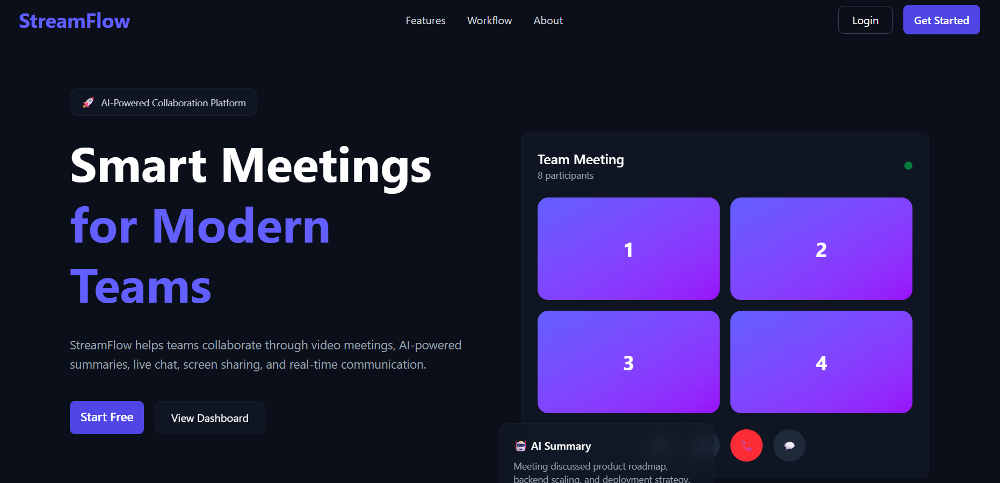
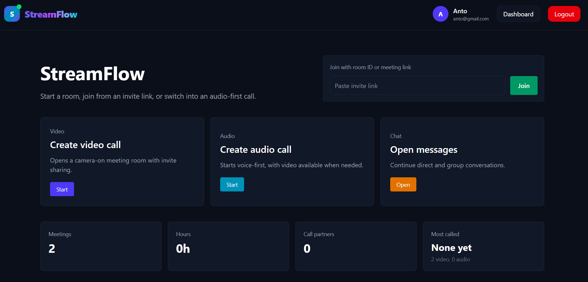
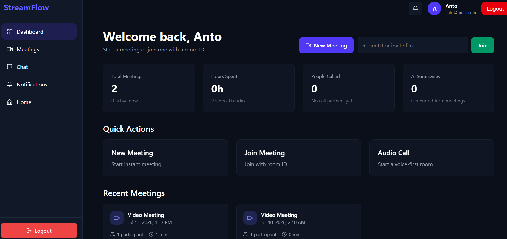
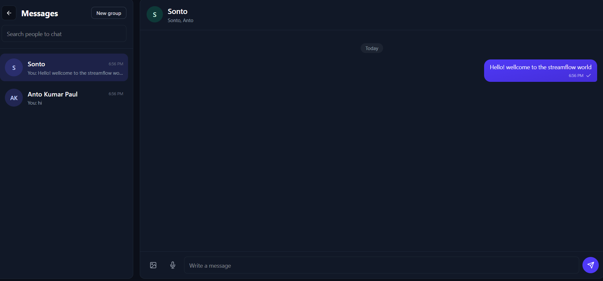

# StreamFlow

StreamFlow is a full-stack collaboration platform for modern teams. It combines video and audio meetings, realtime chat, screen sharing, whiteboard collaboration, meeting history, notifications, and an AI-focused meeting experience in one polished workspace.



## Table of Contents

- [Overview](#overview)
- [Screenshots](#screenshots)
- [Features](#features)
- [Tech Stack](#tech-stack)
- [Project Structure](#project-structure)
- [Getting Started](#getting-started)
- [Environment Variables](#environment-variables)
- [Available Scripts](#available-scripts)
- [API Overview](#api-overview)
- [Realtime Events](#realtime-events)
- [Deployment Notes](#deployment-notes)

## Overview

StreamFlow is built as a two-part application:

- `apps/client`: a Next.js frontend with protected routes, dashboards, meeting rooms, chat, notifications, and responsive UI.
- `apps/server`: an Express, MongoDB, and Socket.IO backend for authentication, meetings, realtime messaging, notifications, WebRTC signaling, and persistent meeting analytics.

The app is designed around fast collaboration workflows: create a meeting, invite participants, communicate through video/audio/chat, share your screen, use the whiteboard, and review recent activity from the dashboard.

## Screenshots

### Home



### Dashboard



### Meeting Room


### Chat



## Features

- Secure user authentication with JWT-based sessions.
- Protected dashboard and workspace routes.
- Create video or audio-first meeting rooms.
- Join meetings with a room ID or invite link.
- WebRTC video/audio calling with Socket.IO signaling.
- Screen sharing support.
- In-meeting participant presence and participant count.
- Realtime meeting chat.
- Collaborative whiteboard drawing and clearing events.
- Direct and group conversations.
- Text, photo, and voice message support.
- Message delivery, read state, typing, edit, and delete events.
- Encrypted message payload storage with AES-256-GCM.
- Meeting history and dashboard analytics.
- Realtime notifications for messages and meeting invitations.
- Responsive dark interface with a professional collaboration-focused layout.

## Tech Stack

### Frontend

- Next.js 16
- React 19
- TypeScript
- Tailwind CSS 4
- Zustand
- Axios
- Socket.IO Client
- next-themes

### Backend

- Node.js
- Express 5
- TypeScript
- MongoDB with Mongoose
- Socket.IO
- JSON Web Tokens
- bcryptjs
- cookie-parser
- dotenv

## Project Structure

```text
StreamFlow/
|-- apps/
|   |-- client/
|   |   |-- public/
|   |   `-- src/
|   |       |-- app/
|   |       |-- components/
|   |       |-- hooks/
|   |       |-- lib/
|   |       |-- providers/
|   |       `-- store/
|   `-- server/
|       |-- src/
|       |   |-- config/
|       |   |-- controllers/
|       |   |-- middlewares/
|       |   |-- models/
|       |   |-- routes/
|       |   |-- services/
|       |   |-- sockets/
|       |   |-- types/
|       |   `-- utils/
|       `-- dist/
|-- photo/
|-- start.png
|-- videomeeting.png
`-- README.md
```

## Getting Started

### Prerequisites

- Node.js 20 or newer
- npm
- MongoDB running locally or a MongoDB Atlas connection string

### 1. Clone the repository

```bash
git clone <repository-url>
cd StreamFlow
```

### 2. Install dependencies

Install server dependencies:

```bash
cd apps/server
npm install
```

Install client dependencies:

```bash
cd ../client
npm install
```

### 3. Configure environment variables

Create `apps/server/.env` and `apps/client/.env.local`. See the [Environment Variables](#environment-variables) section below.

### 4. Start the backend

From `apps/server`:

```bash
npm run dev
```

By default, the backend should run on:

```text
http://localhost:4000
```

### 5. Start the frontend

From `apps/client`:

```bash
npm run dev
```

Open the app in your browser:

```text
http://localhost:3000
```

## Environment Variables

### Server: `apps/server/.env`

```env
PORT=4000
MONGO_URI=mongodb://127.0.0.1:27017/streamflow
JWT_SECRET=replace-with-a-long-random-secret
MESSAGE_ENCRYPTION_KEY=replace-with-a-long-random-secret
CLIENT_URL=http://localhost:3000
CLIENT_URLS=http://localhost:3000
```

| Variable | Required | Description |
| --- | --- | --- |
| `PORT` | Yes | Port used by the Express and Socket.IO server. |
| `MONGO_URI` | Yes | MongoDB connection string. |
| `JWT_SECRET` | Yes | Secret used to sign and verify authentication tokens. |
| `MESSAGE_ENCRYPTION_KEY` | Recommended | Secret used for encrypted chat payloads. Falls back to `JWT_SECRET` if omitted. |
| `CLIENT_URL` | Recommended | Primary allowed frontend origin for CORS. |
| `CLIENT_URLS` | Optional | Comma-separated list of additional allowed frontend origins. |

### Client: `apps/client/.env.local`

```env
NEXT_PUBLIC_API_URL=http://localhost:4000/api
NEXT_PUBLIC_SOCKET_URL=http://localhost:4000
```

| Variable | Required | Description |
| --- | --- | --- |
| `NEXT_PUBLIC_API_URL` | Recommended | Base URL for REST API requests. |
| `NEXT_PUBLIC_SOCKET_URL` | Recommended | Base URL for Socket.IO connections. |

## Available Scripts

### Client

Run from `apps/client`:

| Command | Description |
| --- | --- |
| `npm run dev` | Start the Next.js development server. |
| `npm run build` | Build the production client. |
| `npm run start` | Start the production Next.js server. |
| `npm run lint` | Run ESLint. |

### Server

Run from `apps/server`:

| Command | Description |
| --- | --- |
| `npm run dev` | Start the TypeScript backend with auto-reload. |
| `npm run build` | Compile TypeScript into `dist/`. |
| `npm run start` | Run the compiled backend from `dist/server.js`. |
| `npm run test` | Placeholder test script. |

## API Overview

The backend exposes REST endpoints under `/api`.

| Area | Base Path | Purpose |
| --- | --- | --- |
| Auth | `/api/auth` | Register, login, fetch current user, and logout. |
| Meetings | `/api/meetings` | Create meetings, list meetings, get stats, and send invites. |
| Chat | `/api/chats` | Search users, create conversations, and fetch messages. |
| Notifications | `/api/notifications` | Fetch notifications and mark them as read. |

## Realtime Events

Socket.IO powers the realtime collaboration layer.

| Area | Examples |
| --- | --- |
| Meeting presence | `join-meeting`, `leave-meeting`, `user-joined`, `user-left`, `participant-count` |
| WebRTC signaling | `offer`, `answer`, `ice-candidate` |
| Meeting tools | `meeting-chat-message`, `whiteboard-draw`, `whiteboard-clear` |
| Chat | `join-conversation`, `send-chat-message`, `receive-chat-message`, `chat-typing`, `conversation-read` |
| Message updates | `edit-chat-message`, `delete-chat-message`, `chat-message-updated`, `chat-message-deleted` |
| Notifications | `notification` |

## Deployment Notes

- Build the server before running it in production:

```bash
cd apps/server
npm run build
npm run start
```

- Build the client before deploying to a production host:

```bash
cd apps/client
npm run build
npm run start
```

- Configure production CORS with `CLIENT_URL` or `CLIENT_URLS`.
- Use strong production secrets for `JWT_SECRET` and `MESSAGE_ENCRYPTION_KEY`.
- Use a production MongoDB database such as MongoDB Atlas.
- Ensure the Socket.IO server URL is available to the browser through `NEXT_PUBLIC_SOCKET_URL`.

## License

This project is currently marked as `ISC` in the backend package metadata.
